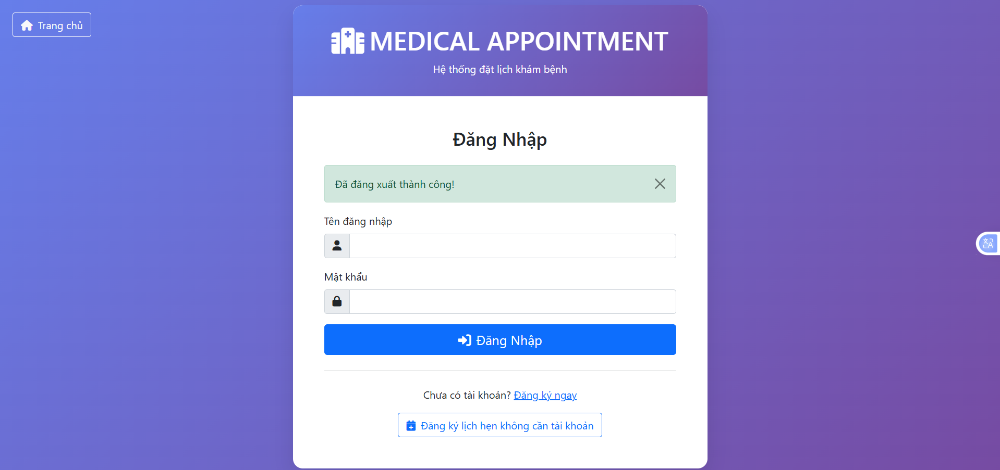
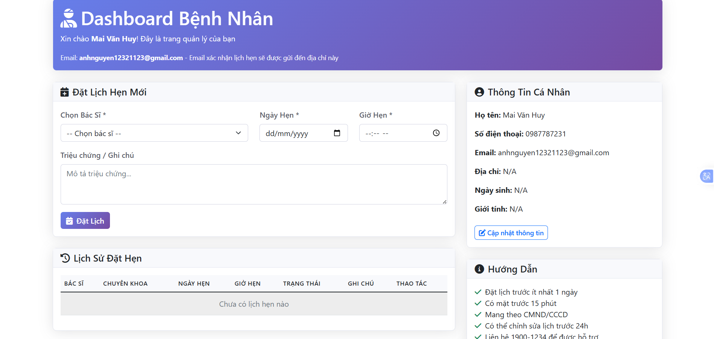
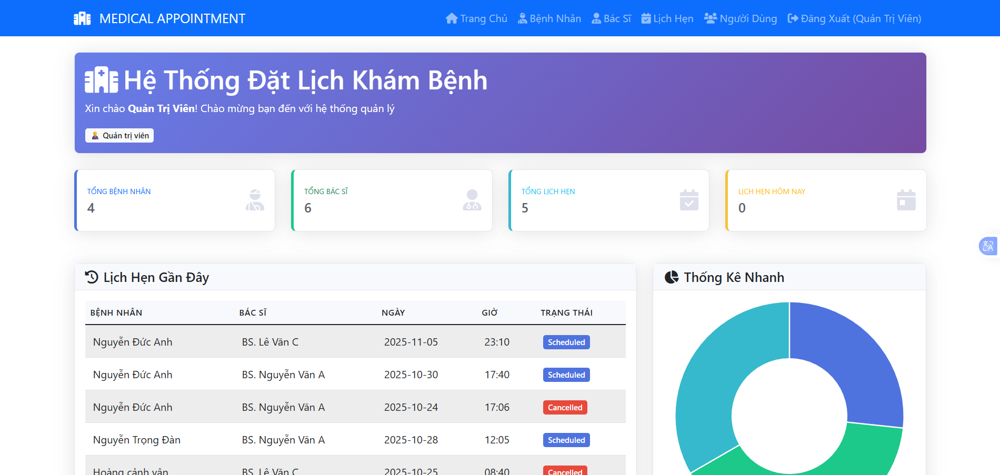
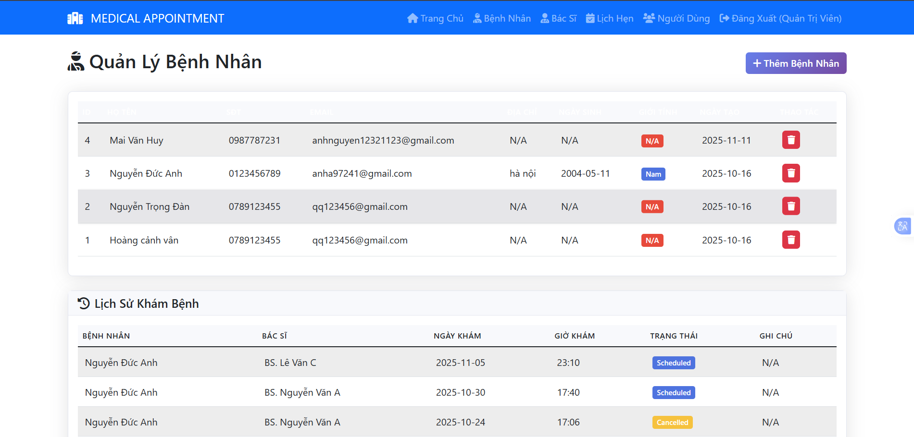
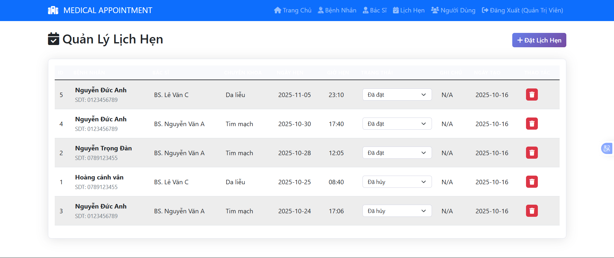
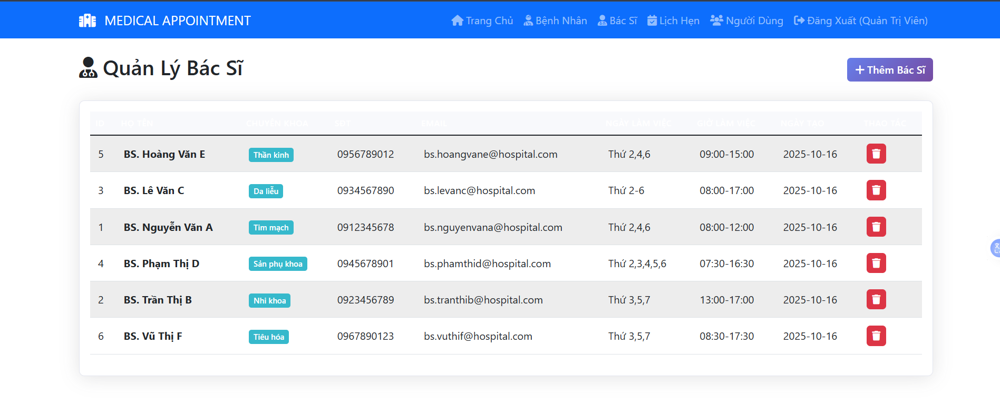

<h2 align="center">
    <a href="https://dainam.edu.vn/vi/khoa-cong-nghe-thong-tin">
    🎓 Faculty of Information Technology (DaiNam University)
    </a>
</h2>
<h2 align="center">
<div align="center">
    <p align="center">
        
        
        
    </p>

[](https://www.facebook.com/DNUAIoTLab)
[](https://dainam.edu.vn/vi/khoa-cong-nghe-thong-tin)
[](https://dainam.edu.vn)

</div>

## 📖 **1. Giới thiệu hệ thống**  
Hệ thống **Medical Appointment System** là giải pháp web toàn diện cho việc quản lý và đặt lịch khám bệnh tại các phòng khám, bệnh viện. Hệ thống được phát triển bằng **Flask (Python)** và **SQLite**, cung cấp giao diện thân thiện và các tính năng quản lý chuyên nghiệp.

- **Mục tiêu chính**: Tự động hóa quy trình đặt lịch khám bệnh, quản lý thông tin bệnh nhân, bác sĩ và lịch hẹn
- **Phạm vi**: Quản lý người dùng, bệnh nhân, bác sĩ, lịch hẹn, gửi email xác nhận, thống kê báo cáo
- **Công nghệ**: Flask + SQLite + Bootstrap 5 + Chart.js + Flask-Mail
- **Người dùng mục tiêu**: Quản trị viên, nhân viên lễ tân, bác sĩ, bệnh nhân

## ✨ **Tính năng chính**

### 🔐 **Xác thực & Phân quyền**
- **4 vai trò người dùng**: 
  - 👨‍💼 **Admin**: Toàn quyền quản trị hệ thống
  - 👩‍💼 **Receptionist**: Quản lý bệnh nhân, bác sĩ, lịch hẹn
  - 👨‍⚕️ **Doctor**: Xem lịch làm việc, thông tin bệnh nhân
  - 👤 **Patient**: Đặt lịch, quản lý thông tin cá nhân
- 🔒 Đăng nhập/Đăng ký với mã hóa **SHA-256**
- 🎯 Session-based authentication với **Flask-Login**
- 🔑 Phân quyền truy cập theo vai trò với decorators

### 👥 **Quản lý Bệnh nhân**
- 📋 **CRUD đầy đủ**: Thông tin cá nhân, liên hệ, địa chỉ, ngày sinh, giới tính
- 📞 Quản lý số điện thoại và email duy nhất
- 📊 Lịch sử khám bệnh chi tiết
- 🔍 Tìm kiếm và lọc nâng cao
- 📅 Theo dõi ngày tạo và cập nhật

### 👨‍⚕️ **Quản lý Bác sĩ**
- 🏥 **Thông tin chuyên môn**: Tên, chuyên khoa, số điện thoại, email
- 📅 **Lịch làm việc**: Ngày làm việc, giờ làm việc cụ thể
- 🔄 Import từ file CSV tự động
- 📊 Quản lý lịch trình và khả năng tiếp nhận

### 📅 **Quản lý Lịch hẹn**
- ➕ **Đặt lịch linh hoạt**: Có tài khoản và không cần tài khoản
- 📧 **Gửi email xác nhận**: Template HTML chuyên nghiệp
- 🔄 **Trạng thái đa dạng**: Scheduled, Confirmed, Completed, Cancelled
- ✏️ **Chỉnh sửa lịch**: Bệnh nhân có thể chỉnh sửa/hủy lịch
- ⏰ **Kiểm tra trùng lịch**: Tự động kiểm tra khung giờ khả dụng

### 📧 **Hệ thống Email**
- ✉️ **Gửi email xác nhận**: Tự động khi đặt lịch thành công
- 🎨 **Template HTML**: Thiết kế chuyên nghiệp, responsive
- 📋 **Thông tin đầy đủ**: Mã lịch hẹn, bác sĩ, ngày giờ, hướng dẫn
- 🔧 **Cấu hình SMTP**: Hỗ trợ Gmail và các SMTP khác

### 📊 **Dashboard & Báo cáo**
- 📈 **Thống kê tổng quan**: 
  - Tổng số bệnh nhân, bác sĩ, lịch hẹn
  - Lịch hẹn hôm nay, lịch hẹn gần đây
- 📊 **Biểu đồ động** (Chart.js):
  - Phân bố thống kê (Doughnut Chart)
  - Xu hướng theo thời gian
- 📋 Danh sách lịch hẹn gần đây
- 🔄 Real-time updates với API endpoints

---

## 🔧 **2. Công nghệ sử dụng**  

<p align="center">
  <a href="https://www.python.org/">
    
  </a>
  <a href="https://flask.palletsprojects.com/">
    
  </a>
  <a href="https://www.sqlite.org/">
    
  </a>
  <a href="https://getbootstrap.com/">
    
  </a>
  <a href="https://www.chartjs.org/">
    
  </a>
  <a href="https://jinja.palletsprojects.com/">
    
  </a>
</p>

### **Backend**
- 🐍 **Python 3.9+**: Ngôn ngữ lập trình chính
- 🌶️ **Flask 2.3.3**: Web framework nhẹ và linh hoạt
- 🗄️ **SQLite**: Cơ sở dữ liệu nhúng, không cần cài đặt server
- 🔐 **Flask-Login**: Quản lý session và authentication
- 📧 **Flask-Mail**: Gửi email xác nhận
- 🗃️ **SQLAlchemy**: ORM cho database operations

### **Frontend**
- 🎨 **Bootstrap 5.1**: CSS framework responsive
- ✨ **Font Awesome 6**: Icon library
- 📊 **Chart.js 3.9**: Thư viện biểu đồ động
- 🎯 **Jinja2**: Template engine
- 🌐 **HTML5, CSS3, JavaScript**: Core web technologies

### **Thư viện Python chính**
```python
Flask==2.3.3
Flask-SQLAlchemy==3.0.5
Werkzeug==2.3.7
Flask-Login==0.6.3
Flask-Mail==0.9.1
```

---

## 🖼️ **3. Giao diện hệ thống**  

### **3.1. Trang Đăng nhập**
<p align="center">
  
  <br>
  <em>Giao diện đăng nhập: Màn hình xác thực người dùng với validation form và thông báo lỗi rõ ràng</em>
</p>

### **3.2. Dashboard - Trang chủ**
<p align="center">
  
  <br>
  <em>Dashboard: Giao diện bệnh nhân </em>
</p>

### **3.3. Quản lý Người dùng và Bác sĩ **
<p align="center">
  
  <br>
  <em>Quản lý: Danh sách sách bác sĩ và người </em>
</p>

### **3.4. Quản lý bệnh nhân và lịch khám bệnh **
<p align="center">
  
  <br>
  <em>Chi tiết bệnh nhân: Hiển thị đầy đủ thông tin bệnh nhân.</em>
</p>

### **3.5. Quản lý Lịch hẹn **
<p align="center">
  
  <br>
  <em>Quản lý người dùng: admin chỉnh sửa và xác nhận  </em>
</p>


### **3.6. Quản lý bác sĩ **
<p align="center">
  
  <br>
  <em>Thông tin : Bác sĩ</em>
</p>


---

## ⚙️ **4. Cài đặt & Chạy ứng dụng**

### 📋 **4.1. Yêu cầu hệ thống**

- 🐍 **Python**: Phiên bản 3.9 trở lên (khuyến nghị Python 3.10 hoặc 3.11)
- 💻 **Hệ điều hành**: Windows, macOS, hoặc Linux
- 🖥️ **IDE**: VS Code, PyCharm, hoặc bất kỳ text editor nào
- 💾 **Bộ nhớ**: Tối thiểu 2GB RAM, khuyến nghị 4GB
- 💿 **Dung lượng**: Tối thiểu 200MB trống

### 📥 **4.2. Các bước cài đặt**

#### **🧰 Bước 1: Chuẩn bị môi trường**

**Cài đặt Python:**
- Tải Python tại: [python.org/downloads](https://www.python.org/downloads/)
- Kiểm tra cài đặt:
```powershell
python --version
pip --version
```

**Clone hoặc Download dự án:**
```powershell
# Nếu có Git
https://github.com/nguyenducanh1152004/CDS_QLLichkhambenhthongminh.git

# Hoặc download ZIP và giải nén
cd c:\cds
```

#### **🔧 Bước 2: Tạo môi trường ảo (Virtual Environment)**

```powershell
# Tạo virtual environment
python -m venv venv

# Kích hoạt trên Windows
.\venv\Scripts\activate

# Kích hoạt trên Linux/MacOS
source venv/bin/activate
```

Sau khi kích hoạt, bạn sẽ thấy `(venv)` xuất hiện trước dòng lệnh.

#### **📦 Bước 3: Cài đặt các thư viện cần thiết**

```powershell
pip install -r requirements.txt
```

**Danh sách thư viện sẽ được cài:**
- Flask 3.0.0
- Flask-Login 0.6.3
- Flask-Bcrypt 1.0.1
- Flask-WTF 1.2.1
- Flask==2.3.3
- Flask-SQLAlchemy==3.0.5
- Werkzeug==2.3.7
- Flask-Login==0.6.3
- Flask-Mail==0.9.1

#### **🗄️ Bước 4: Khởi tạo Database**

```lấy từ file csv
# chạy app.py sẽ tự động lấy dữ liệu và tự sinh.

#### **▶️ Bước 5: Chạy ứng dụng**

```powershell
# Chạy Flask development server
python app.py

```

**Server sẽ khởi động tại:**
 - Running on http://127.0.0.1:5000
 - Running on http://192.168.1.23:5000

---

## 👤 **5. Tài khoản đăng nhập mặc định**

Sau khi chạy lệnh `python app.`, hệ thống tạo sẵn 2 tài khoản:

| Vai trò | Username | Password | Quyền hạn |
|---------|----------|----------|-----------|
| 👨‍💼 **admin** | `admin` | `admin123` | Toàn quyền hệ thống |
| 👩‍💼 **reception** | `reception` | `reception123` | Quản lý cơ bản |

---

## 🗂️ **6. Cấu trúc thư mục dự án**

--- 
C:\BTL_
├── app.py                          # File chính - Flask application
├── requirements.txt                # Python dependencies
├── medical_appointment.db          # SQLite database (tự động tạo)
├── doctors.csv                     # Dữ liệu bác sĩ mẫu
├── templates/                      # Jinja2 templates
│   ├── base.html                  # Template layout chính
│   ├── home.html                  # Trang chủ sau login
│   ├── login.html                 # Trang đăng nhập
│   ├── register.html              # Trang đăng ký
│   ├── public_index.html          # Trang chủ công khai
│   ├── public_appointment.html    # Đặt lịch không cần tài khoản
│   ├── appointment_success.html   # Thông báo đặt lịch thành công
│   ├── patient_dashboard.html     # Dashboard bệnh nhân
│   ├── patients.html              # Quản lý bệnh nhân
│   ├── doctors.html               # Quản lý bác sĩ
│   ├── appointments.html          # Quản lý lịch hẹn
│   ├── users.html                 # Quản lý người dùng (admin)
│   └── index.html                 # Template dashboard
├── static/                         # Static files
│   ├── css/
│   │   └── style.css              # Custom styles
│   ├── js/
│   │   └── script.js              # Custom JavaScript
│   └── uploads/                   # Thư mục upload file
└── README.md                       # Tài liệu dự án


## 📜 **8. License**

Dự án này được phát triển cho mục đích học tập tại **Khoa Công nghệ Thông tin - Đại học Đại Nam**.

© 2025 - Đại học Đại Nam. All rights reserved.

---

## 📬 **9. Liên hệ**

### **👨‍🎓 Sinh viên thực hiện**
- **Họ tên:** Nguyễn Đức Anh
- **Mã sinh viên:** 1671020023
- **Lớp:** CNTT 16-04

### **🏫 Đơn vị**
- **Khoa:** Công nghệ thông tin
- **Trường:** Đại học Đại Nam
- 🌐 **Website:** [dainam.edu.vn/vi/khoa-cong-nghe-thong-tin](https://dainam.edu.vn/vi/khoa-cong-nghe-thong-tin)
- 📱 **Fanpage:** [AIoTLab - FIT DNU](https://www.facebook.com/DNUAIoTLab)
- 📧 **Email:** contact@example.com


### **🔗 Repository**
- **GitHub:** [github.com/nguyenducanh1152004/CDS_QLLichkhambenhthongminh](https://github.com/nguyenducanh1152004/CDS_QLLichkhambenhthongminh)
- **Issues:** [ggithub.com/nguyenducanh1152004/CDS_QLLichkhambenhthongminh/issues](https://github.com/nguyenducanh1152004/CDS_QLLichkhambenhthongminh/issues)

---

<div align="center">

### ⭐ **Nếu bạn thấy dự án hữu ích, hãy cho một Star nhé!** ⭐

**Made with ❤️ by Students of DaiNam University**

[](https://github.com/nguyenducanh1152004/CDS_QLLichkhambenhthongminh)
[](https://github.com/nguyenducanh1152004/CDS_QLLichkhambenhthongminh/fork)


</div>
